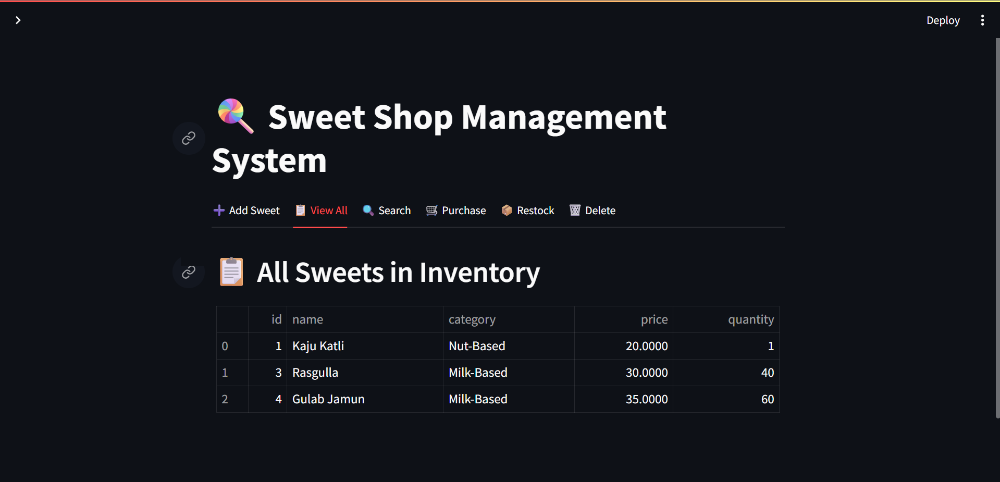
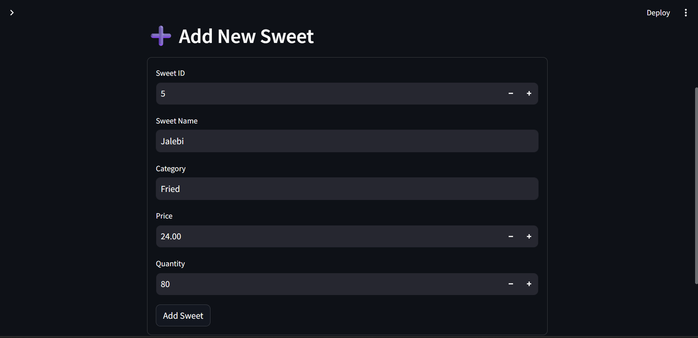
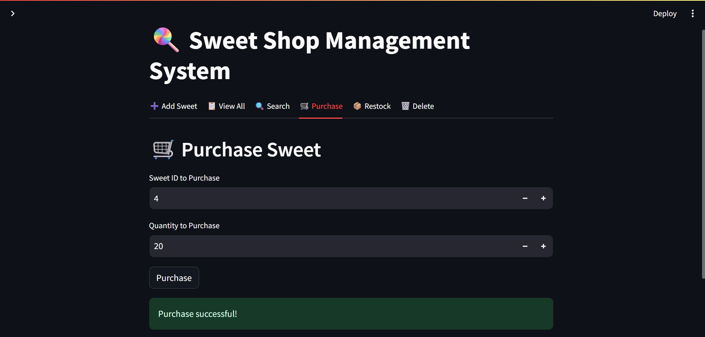
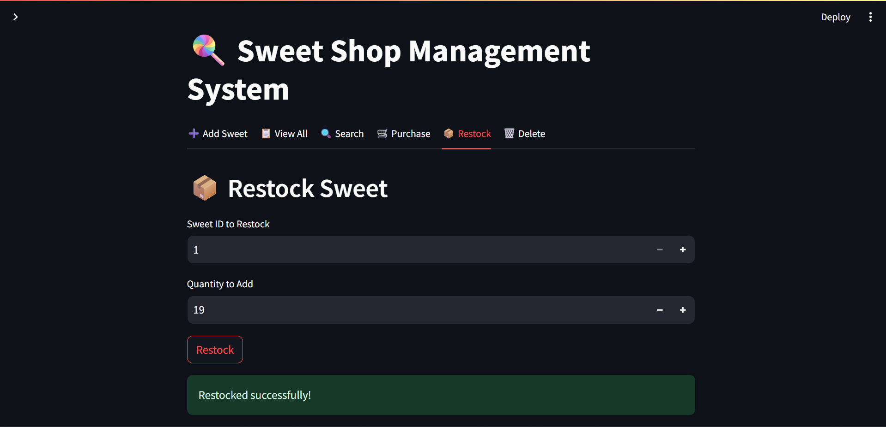
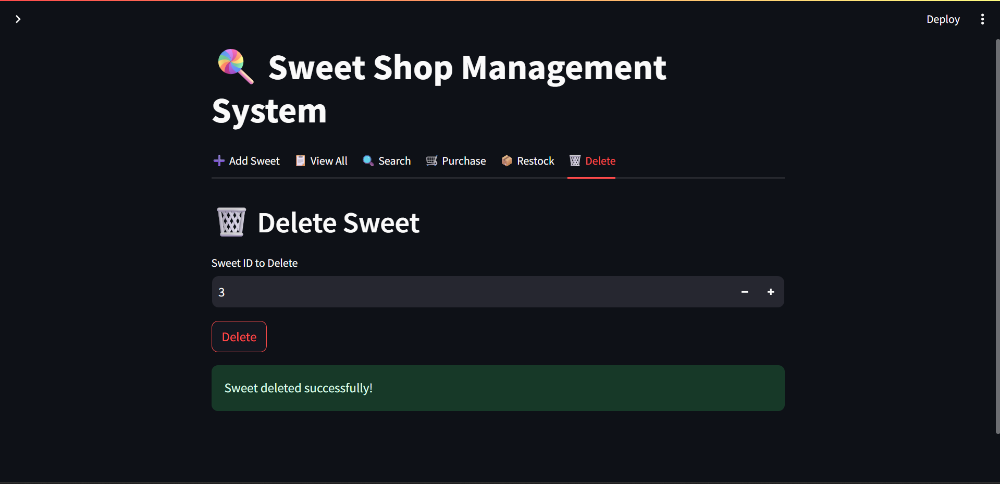

# 🍬 Sweet Shop Management System

A fully functional Sweet Shop Inventory Management System built using Python, SQLite, TDD principles, and a modern Streamlit frontend.

> 🚀 Developed for an assignment with a strict Test-Driven Development workflow  
> 🧪 100% unit test coverage  
> 🎨 Includes a responsive, interactive Streamlit web interface

---

## 📥 How to Clone and Run Locally

### 1. Clone the Repository

```bash
git clone https://github.com/MihirPrajapati04/sweetshop.git
cd sweetshop
````

### 2. Create a Virtual Environment (optional but recommended)

```bash
python -m venv venv
source venv/bin/activate  # On Windows: venv\Scripts\activate
```

### 3. Install Dependencies

```bash
pip install -r requirements.txt
```

### 4. Run the Web App

```bash
streamlit run sweetshop_app.py
```

---

## ✅ Features Implemented

| Category       | Description                                         |
| -------------- | --------------------------------------------------- |
| 🧾 Add Sweet   | Add new sweet with name, category, price, qty       |
| 📋 View All    | View all sweets in a table format                   |
| 🔍 Search      | Search sweets by name, category, or price range     |
| 🛒 Purchase    | Reduce stock when a customer purchases sweets       |
| 📦 Restock     | Increase stock quantity for a sweet                 |
| 🗑️ Delete     | Remove a sweet entry by ID                          |
| ✅ TDD          | All logic was written using Test-Driven Development |
| 🧪 Unit Tested | 20+ test cases using Python’s `unittest`            |

---

## 📂 Project Structure

```
sweetshop/
├── database/
│   └── db.py                  # DBManager: manages SQLite connection
├── models/
│   └── sweet.py               # Sweet dataclass (id, name, category, etc.)
├── sweetshop/
│   ├── add_service.py         # Add logic
│   ├── view_service.py        # View logic
│   ├── search_service.py      # Name search
│   ├── category_search_service.py  # Category search
│   ├── price_search_service.py     # Price range search
│   ├── inventory_service.py   # Purchase / Restock logic
│   ├── delete_service.py      # Delete by ID
├── tests/
│   ├── test_add_service.py
│   ├── test_view_service.py
│   ├── test_search_service.py
│   ├── test_category_search_service.py
│   ├── test_price_search_service.py
│   ├── test_delete_service.py
│   └── test_inventory_service.py
├── sweetshop_app.py # ✅ Streamlit frontend
├── requirements.txt
├── test_report.txt
└── README.md
```

---

## 🧪 Running Tests

Tests are written using the built-in `unittest` module.

```bash
python -m unittest discover tests/
```

✅ All service classes (add, delete, view, inventory, etc.) have full test coverage.
📄 A test report is available in [`test_report.md`](./test_report.md)

---

## 🖼️ Screenshots

### 📋 View All Sweets



### ➕ Add Sweet



### 🛒 Purchase Sweet



### 📦 Restock Sweet



### 🗑️ Delete Sweet




---

## 🌐 Deploy (Optional - Streamlit Cloud)

Want to share this online?

1. Push your project to GitHub (done ✅)
2. Go to [Streamlit Cloud](https://streamlit.io/cloud)
3. Click **“New app”**
4. Set the repo and `sweetshop/sweetshop_app.py` as entrypoint
5. Deploy 🚀

---

## 👨‍💻 Author

**Mihir Prajapati**
📚 LDCE – Computer Engineering
🛠️ Developed for Incubyte Kata Assignment
🔗 [github.com/MihirPrajapati04](https://github.com/MihirPrajapati04)

---

